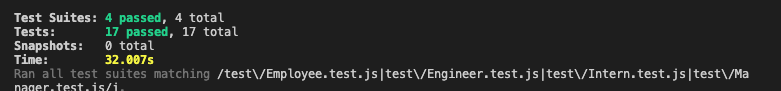
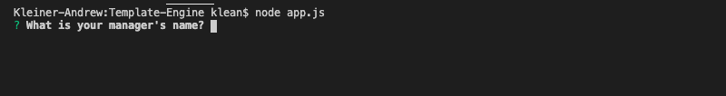
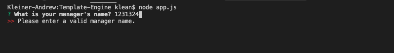
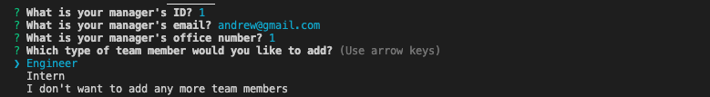
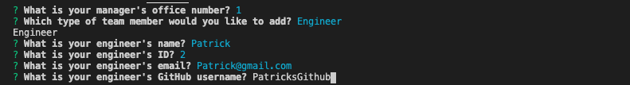
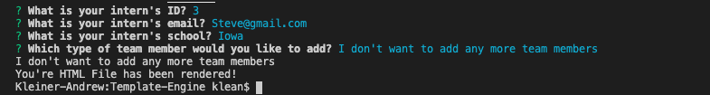
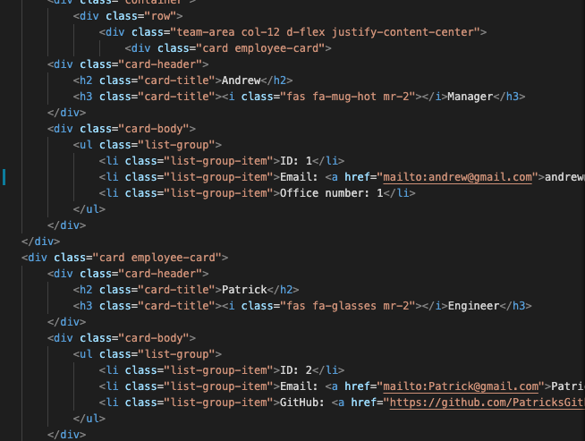
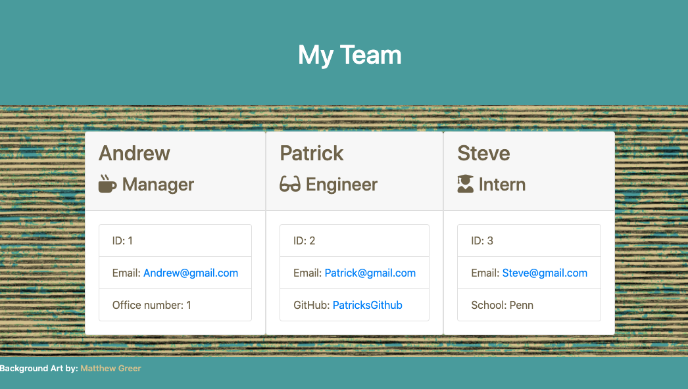

# Template Engine

## About:
As modern day coding becomes more and more integrated into a team environment, one of the most important skills for a web developer to acquire is the ability to write readable code. Not only does a web developer need to be able to revisit past code, and update to meet modern requirements, but other coders need to be able to approach script, interpret it easily. This ensures a cooperative work environment.

This Template Engine app had inherited code, and was assimilated with JavaScript testing, and CLI questionnaires built out of node inquirer. Making sure that the code was legible across both inherited, and written script was a main priority. In order to ensure this, Jest testing was implemented to guarantee seamless integration. 

## Index
1) [About](#About)
1) [Installation](#Installation)
2) [Usage](#Usage)
3) [Contributors](#Contributors)
4) [GitHub](#GitHub)

## Installation:
Please enter npm install into your CLI to install all necessary dependencies.

## Usage:
Enter node app.js into your CLI while in the root folder in order to launch the application. Follow all directions, until you are prompted that your html has been rendered.

## Contributors:
Andrew Kleiner\
Background Artwork: Matthew Greer

## Tests:
Enter npm run test into your CLI in order to run Jest.

## GitHub Username:
akleiner26

## GitHub Repo:
https://github.com/akleiner26

## GitHub Photo:
 

## GitHub Email:
AndrewJKleiner@gmail.com

## Screenshots:
### Pass Test:

### First Prompt:

### Validator

### New Role

### App Running

### Final Prompt

### Final Html

### Final Site Rendered

